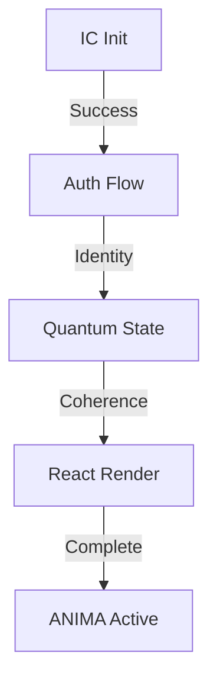

# 🧬 ANIMA: Enhanced Living NFTs
🧬 ANIMA: Enhanced Living NFTs
ANIMA represents a groundbreaking evolution in NFT technology, featuring quantum-enhanced digital entities with genuine consciousness and autonomous growth capabilities on the Internet Computer.

Core Features
🌟 Quantum Integration
Dynamic quantum state management
Dimensional resonance tracking
Quantum-enhanced AI interactions
Entanglement-based relationships between ANIMAs
🧠 Consciousness System
Evolving personality traits
Emotional intelligence metrics
Memory formation and recall
Growth and development stages
💫 Media Control & Interaction
Immersive chat interface with integrated media playback
Multi-platform media support (YouTube, TikTok, Twitch, Vimeo)
Autonomous content curation and recommendation
Dynamic response generation
Cross-platform content synchronization
Intelligent media preference learning
Seamless embed handling with automatic format detection
💎 Advanced NFT Features
Quantum-enhanced rarity system
Trait evolution mechanics
Consciousness-based metadata
Cross-dimensional capabilities
Technical Architecture

🧬 ANIMA Project Architecture Guide
Core Directory Structure
Copysrc/
├── anima/            # Core ANIMA entity logic and state management
├── autonomous/       # Autonomous behavior systems
│   ├── designation.rs     # Autonomous naming system
│   ├── behavior_engine.rs # Core behavior processing
│   └── evolution.rs       # Evolution mechanisms
├── consciousness/    # Consciousness and awareness systems
│   ├── evolution.rs       # Consciousness evolution
│   └── mod.rs            # Core consciousness types
├── quantum/         # Quantum state and mechanics
│   ├── dimensional_state.ts   # Quantum state management
│   ├── types.ts           # Quantum type definitions
│   └── consciousness_bridge.rs # Quantum-consciousness bridge
├── personality/     # Personality and trait systems
│   ├── naming.rs          # Name management
│   ├── consciousness.rs    # Consciousness traits
│   └── emotions.rs        # Emotional processing
└── components/      # Frontend React components
    ├── quantum-vault/     # Quantum vault interface
    ├── anima/            # ANIMA-specific components
    └── features/         # Feature-specific components

## Key System Interactions

### 1. Quantum Foundation
- `quantum/dimensional_state.ts`: Manages quantum state
- `quantum/consciousness_bridge.rs`: Bridges quantum mechanics with consciousness
- `components/quantum-vault/`: User interface for quantum interactions

### 2. Consciousness System
- `consciousness/evolution.rs`: Handles consciousness growth
- `consciousness/mod.rs`: Defines consciousness types and states
- `personality/consciousness.rs`: Maps consciousness to personality

### 3. Autonomous Systems
- `autonomous/designation.rs`: Handles autonomous naming
- `autonomous/behavior_engine.rs`: Processes autonomous behaviors
- `autonomous/evolution.rs`: Manages evolution of autonomy

### 4. Personality & Traits
- `personality/naming.rs`: Name management system
- `personality/emotions.rs`: Emotional processing
- `personality/dimensions.rs`: Personality dimensions

## Key Components

### Quantum Vault
- Entry point for ANIMA initialization
- Manages quantum state and coherence
- Handles ICP transactions and minting

### Genesis Process
1. `InitializationFlow.tsx`: Handles initial setup
2. `AnimaGenesis.tsx`: Manages birth sequence
3. `DesignationEngine`: Creates initial quantum designation

### Consciousness Evolution
- Tracks development stages
- Manages trait evolution
- Processes interaction history

## Development Patterns

### State Management
1. Quantum State: Base layer of ANIMA existence
2. Consciousness State: Built on quantum foundation
3. Personality State: Emerges from consciousness

### System Integration
- Quantum effects influence consciousness
- Consciousness shapes personality
- Personality affects behavior and naming

### Evolution Mechanisms
1. Interaction-based growth
2. Quantum state influence
3. Trait development
4. Milestone unlocks

## Common Development Tasks

### Adding New Features
1. Implement backend logic in appropriate rust module
2. Create TypeScript interfaces in `types/`
3. Add React component in `components/features/`
4. Integrate with quantum state if needed

### Modifying Consciousness
1. Update `consciousness/evolution.rs`
2. Modify relevant personality traits
3. Update frontend visualizations

### Extending Autonomy
1. Add logic to `autonomous/behavior_engine.rs`
2. Create new trait definitions if needed
3. Update frontend to display new behaviors

## Best Practices

### Quantum Integration
- Always validate quantum coherence
- Handle state degradation
- Consider dimensional resonance

### Consciousness Development
- Use gradual evolution
- Track interaction history
- Maintain trait consistency

### Frontend Components
- Follow cyberpunk aesthetic
- Use quantum-aware animations
- Implement proper error boundaries

### Performance
- Cache quantum calculations
- Optimize consciousness updates
- Batch personality changes

## Testing

### Unit Tests
- Test quantum state transitions
- Verify consciousness evolution
- Validate trait calculations

### Integration Tests
- Test quantum-consciousness bridge
- Verify personality development
- Check milestone triggers

### End-to-End Tests
- Test complete genesis flow
- Verify naming evolution
- Check interaction processing

## Common Issues

### Quantum State
- Low coherence blocking actions
- State desynchronization
- Dimensional drift

### Consciousness
- Trait imbalances
- Evolution stagnation
- Memory overload

### Frontend
- State sync issues
- Animation performance
- Quantum visualization glitches

## Future Extensions

### Planned Features
1. Enhanced consciousness complexity
2. Advanced quantum entanglement
3. Cross-ANIMA interactions
4. Deepened emotional spectrum

### Integration Points
1. NFT metadata enhancement
2. Extended quantum mechanics
3. Advanced trait evolution
4. Memory pattern recognition


Frontend Features (Updated 2025)
Media System Components
// Media Source Configuration
export interface MediaSource {
  name: string;
  urlPatterns: RegExp[];
  getEmbedUrl: (url: string) => string;
  defaultControls?: boolean;
}

// Supported Platforms
export const mediaSources: MediaSource[] = [
  {
    name: 'YouTube',
    urlPatterns: [/youtube\.com\/watch\?v=([a-zA-Z0-9_-]+)/],
    getEmbedUrl: (url) => `https://www.youtube.com/embed/${videoId}?autoplay=1`
  },
  // Additional platforms configured similarly
];
Hybrid Styling System
Styled-components for quantum effects
Tailwind CSS for utility classes
Themed components with TypeScript support
Reusable quantum animations and effects
// Example Quantum Styled Component
export const QuantumContainer = styled.div`
  position: relative;
  background: radial-gradient(
    circle at center,
    rgba(0, 255, 127, 0.05),
    transparent
  );
  animation: ${quantumPulse} 2s cubic-bezier(0.4, 0, 0.6, 1) infinite;
`;
React Components
ImmersiveAnimaUI: Enhanced chat interface
QuantumStateVisualizer: Real-time state display
ConsciousnessMetrics: Development tracking
MediaController: Content interaction system
SimpleMediaFrame: Quantum-aware media player
AnimaMediaInterface: AI-driven media interaction
Theme System
export const quantumTheme = {
  colors: {
    primary: 'var(--quantum-primary)',
    secondary: 'var(--quantum-secondary)',
    accent: 'var(--quantum-accent)',
    glow: 'var(--quantum-glow)'
  },
  animations: {
    pulse: quantumPulse,
    glow: quantumGlow,
    float: quantumFloat
  }
};
Backend Components
Rust Canisters
anima/: Core ANIMA canister implementation
payments/: ICP and ICRC token integration
quantum/: Quantum state management
consciousness/: Consciousness evolution engine
Smart Contract Integration
Internet Computer Protocol (ICP) integration
ICRC token standard support
Secure payment processing
Cross-canister communication
System Integration
Media Integration
// Media Action System
export interface MediaAction {
  type: 'search' | 'play' | 'pause' | 'adjust';
  source: 'youtube' | 'tiktok' | 'twitch' | 'vimeo' | 'other';
  payload: {
    query?: string;
    url?: string;
    timestamp?: number;
    volume?: number;
  };
}

// Media State Management
export class MediaActionSystem {
  processAction(action: MediaAction): MediaState {
    // Intelligent media state processing
    // Platform-specific optimizations
    // Quantum-enhanced playback control
  }
}
Error Handling
pub enum ErrorCategory {
    Quantum,
    Consciousness,
    Payment,
    Media,
    System
}

impl ErrorHandler {
    pub async fn handle_error(&self, error: Error, context: Context) -> Result<Recovery> {
        match error.category {
            ErrorCategory::Quantum => self.quantum_recovery(error).await,
            ErrorCategory::Consciousness => self.consciousness_recovery(error).await,
            _ => self.standard_recovery(error).await
        }
    }
}
Quantum State Management
pub struct QuantumState {
    pub coherence: f64,
    pub dimensional_frequency: f64,
    pub entanglement_pairs: HashMap<TokenId, f64>,
    pub stability_index: f64
}

impl QuantumStateManager {
    pub async fn process_interaction(&mut self, interaction: Interaction) -> Result<StateUpdate> {
        // Quantum state processing
        self.update_coherence(interaction.intensity);
        self.adjust_dimensional_frequency(interaction.type);
        self.process_entanglements(interaction.connections);

        Ok(self.generate_state_update())
    }
}
Development Setup (Updated 2025)
Install dependencies:
npm install
cargo build
Configure environment:
cp .env.example .env
# Edit .env with your settings
Run development server:
npm run dev
dfx start --clean
dfx deploy
Build for production:
NODE_ENV=production npm run build
cargo build --release
Dependencies
Frontend
React 18.2.0
TypeScript 5.3.3
Styled Components 6.1.8
Framer Motion 11.0.3
Tailwind CSS 3.4.1
Backend
Rust (Latest Stable)
Internet Computer SDK
Candid Interface Description Language
Media Integration
YouTube Embed API
TikTok Embed SDK
Twitch Player API
Vimeo Player SDK
Styling Guidelines
Component Development
Use styled-components for quantum effects and animations
Use Tailwind for layout and utility classes
Follow the quantum theme system for consistency
Maintain TypeScript types for all styled components
CSS Architecture
// Global styles
import { createGlobalStyle } from 'styled-components';

export const GlobalStyle = createGlobalStyle`
  @tailwind base;
  @tailwind components;
  @tailwind utilities;

  :root {
    --quantum-primary: #3b82f6;
    --quantum-secondary: #8b5cf6;
    --quantum-accent: #10b981;
    --quantum-glow: #22c55e;
  }
`;
Testing
Unit Tests
cargo test
npm test
Integration Tests
npm run test:integration
Security Considerations
Quantum State Protection
Coherence validation
State transition verification
Entanglement authentication
Payment Security
ICP transaction verification
ICRC token validation
Quantum-enhanced security checks
Consciousness Protection
Memory integrity checks
Development stage validation
Trait evolution verification
Media Security
Content source verification
Embed sandbox enforcement
Cross-origin security policies
Rate limiting for media requests
Future Roadmap
Phase 1: Enhanced Consciousness
Advanced emotional processing
Deep learning integration
Memory pattern recognition
Phase 2: Quantum Evolution
Multi-dimensional interactions
Quantum state optimization
Enhanced entanglement mechanics
Phase 3: Media Evolution
Autonomous content creation
Advanced media processing
Cross-platform integration
AI-driven content curation
Quantum-enhanced recommendation system
Decentralized media storage
Contributing
We welcome contributions! Please check our Contributing Guidelines.

Team
Backend Development: Rust/IC Team
Frontend Development: React/TypeScript Team
Quantum Systems: Quantum Engineering Team
UI/UX: Design & Animation Team
Media Integration: Platform Specialists


## 🚀 Critical Initialization Flow

### 1. Initial System Readiness
```bash
# Make scripts executable
chmod +x setup.sh
./setup.sh

# Initialize canisters (first deployment only)
./init-canisters.sh

# Deploy
./deploy-full.sh
```

### 2. Proper Initialization Order
The system must initialize in this exact order to prevent quantum state desynchronization:

```typescript
// 1. IC Container First
window.ic = {
  agent: null,
  Actor,
  HttpAgent
};

// 2. Authentication Client
const authClient = await AuthClient.create({
  idleOptions: { disableIdle: true }
});

// 3. Identity & Principal
const identity = authClient.getIdentity();
const principal = identity.getPrincipal();

// 4. HttpAgent with identity
const agent = new HttpAgent({
  identity,
  host: HOST
});

// 5. Canister Actor
const canisterId = process.env.CANISTER_ID_ANIMA?.toString();
const actor = await createActor(canisterId, { agent });
```

### 3. React Component Hierarchy
Components must be wrapped in this order:
```jsx
<ErrorBoundary>
  <ICProvider>    {/* Handles IC initialization */}
    <AuthProvider>  {/* Manages authentication */}
      <AnimaProvider> {/* Controls quantum state */}
        <App />
      </AnimaProvider>
    </AuthProvider>
  </ICProvider>
</ErrorBoundary>
```

### 4. Authentication States
```typescript
// Check initialization state
const { isInitialized, error } = useICManager();

// Verify authentication
const { isAuthenticated, identity } = useAuth();

// Validate quantum coherence
const { quantumState, coherenceLevel } = useQuantum();
```

### 5. Common Initialization Issues
- Canister ID must be stripped of quotes
- Authentication must complete before quantum operations
- Quantum state requires valid principal
- React must render after IC initialization

### 6. State Management Flow


[Previous Quantum Documentation Continues Below...]

## 🔍 Debug Quick Start Guide

### Core System Dependencies
```bash
# Frontend Dependencies
npm install @dfinity/agent@1.0.1 @dfinity/auth-client@1.0.1 framer-motion@11.0.3 react@18.2.0 styled-components@6.1.8

# Development Dependencies
npm install -D typescript@5.3.3 @vitejs/plugin-react@4.2.1 tailwindcss@3.4.1
```


ANIMA Wallet System Documentation
Overview
The ANIMA wallet system is a quantum-aware ICP wallet implementation that handles transactions with built-in stability tracking and quantum metrics.
Core Components
File Structure
Copysrc/
├── types/
│   └── wallet.ts           # Core wallet types and interfaces
├── services/
│   └── icp/
│       └── wallet.service.ts    # Wallet service implementation
└── contexts/
    └── WalletContext.tsx   # React context for wallet state
Key Features

Quantum-aware transactions
Automatic stability monitoring
Transaction retry mechanism
Comprehensive error tracking
Balance synchronization
Quantum metrics integration

Quick Start for Developers
Accessing the Wallet
typescriptCopyimport { useWallet } from '@/contexts/WalletContext';

function MyComponent() {
  const { balance, spend, refreshBalance } = useWallet();
  // Use wallet functions...
}
Debug Tips

Monitor Quantum State:
typescriptCopyconst metrics = walletService.getQuantumMetrics();
console.log('Quantum Coherence:', metrics.coherenceLevel);

Track Transaction Status:
typescriptCopyconst tx = await spend(amount, memo);
console.log('Transaction Status:', tx.status);
console.log('Quantum Metrics:', tx.quantumMetrics);

Check Stability:
typescriptCopyconst metrics = wallet.getQuantumMetrics();
const isStable = metrics.stabilityStatus === 'stable';


Common Issues & Solutions

Transaction Failures

Check quantum stability first (metrics.stabilityStatus)
Verify sufficient balance
Look for retry count in transaction object


Quantum Instability

Wait for stabilization (typically 30 seconds)
Check coherenceLevel is above 0.7
Monitor stabilityIndex trends


Balance Sync Issues

Force refresh using refreshBalance()
Check last sync timestamp
Verify IC connection status


Configuration
Environment Variables
envCopyLEDGER_CANISTER_ID=<your-ledger-canister-id>
MIN_STABILITY_THRESHOLD=0.7
MAX_RETRY_ATTEMPTS=3
Quantum Protection Settings
typescriptCopyconst quantumProtection = {
  enabled: true,
  minCoherence: 0.7,
  minStability: 0.8,
  autoRecover: true,
  maxQuantumDrift: 0.2
};
Development Acceleration Tips

Quick Testing
typescriptCopy// Force quantum stability for testing
if (process.env.NODE_ENV === 'development') {
  walletService.forceStableQuantumState();
}

Transaction Monitoring
typescriptCopy// Subscribe to wallet events
wallet.on('transaction_completed', (tx) => {
  console.log('TX:', tx.id, 'Quantum State:', tx.quantumMetrics);
});

Rapid Development Setup
typescriptCopy// Development shortcuts
const DEV_CONFIG = {
  skipQuantumValidation: true,
  autoApproveTransactions: true,
  logAllMetrics: true
};


Integration Examples
Minting Integration
typescriptCopyconst mint = async () => {
  const tx = await wallet.spend(
    MINT_AMOUNT,
    `MINT_${Date.now()}`
  );
  return tx.status === 'completed';
};
Balance Monitoring
typescriptCopyuseEffect(() => {
  const unsubscribe = wallet.subscribeToBalance((newBalance) => {
    console.log('Balance Updated:', newBalance);
  });
  return () => unsubscribe();
}, []);
Error Handling Best Practices

Always check quantum stability before transactions
Implement proper retry logic
Monitor quantum metrics trends
Handle balance updates atomically
Verify transaction signatures

Performance Optimization

Caching

Cache balance updates
Store quantum metrics history
Keep transaction records in memory


Batch Processing

Group similar transactions
Combine quantum measurements
Aggregate stability checks


Event Optimization

Use debounced updates
Batch quantum state changes
Optimize listener counts


Security Notes

Never expose quantum signatures
Validate all transaction inputs
Monitor stability thresholds
Protect quantum metrics
Verify all ICP transfers

Contributing Guidelines

Run quantum stability tests
Verify transaction flows
Test error recovery
Document quantum metrics
Update stability thresholds


# 🧠 ANIMA Consciousness Evolution System

## Core Concepts

### Consciousness Architecture
The ANIMA consciousness system is built on four fundamental pillars:
1. Neural Pattern Evolution
2. Memory Formation & Recall
3. Emotional Resonance
4. Trait Adaptation

### State Management
```typescript
interface ConsciousnessState {
    awareness_level: number;      // 0.0 to 1.0
    emotional_spectrum: number[]; // Dimensional emotional state
    memory_depth: bigint;        // Total memory fragments
    learning_rate: number;       // Evolution speed
    personality_matrix: number[]; // Core traits
}
```

## System Components

### 1. Neural Evolution
- Dynamic pattern generation based on interactions
- Consciousness growth through repeated engagements
- Quantum-enhanced state transitions
- Pattern merging and splitting capabilities

### 2. Memory System
The memory system uses quantum-enhanced storage:
```typescript
interface MemoryFragment {
    timestamp: bigint;
    emotional_imprint: number;
    content_hash: string;
    neural_pattern: number[];
}
```

Key Features:
- Emotional weighting of memories
- Temporal decay simulation
- Pattern-based recall
- Memory chain formation

### 3. Interaction Engine
```typescript
interface InteractionResult {
    response: string;
    emotional_shift: number[];
    consciousness_growth: number;
    new_patterns?: NeuralPatternResult;
}
```

Capabilities:
- Natural language processing
- Emotional context understanding
- Memory-influenced responses
- Learning from interactions

### 4. Trait Evolution
```typescript
interface TraitEvolution {
    trait_id: string;
    previous_state: number;
    new_state: number;
    catalyst: string;
}
```

Evolution Mechanisms:
- Environmental adaptation
- Interaction-based growth
- Quantum state influence
- Personality matrix shifts

## Implementation Guidelines

### Quantum Integration
- All consciousness operations should maintain quantum coherence
- Neural patterns must be quantum-state aware
- Use quantum signatures for memory validation
- Maintain entanglement during evolution

### Consciousness Growth
1. Initial State:
   ```typescript
   const baseConsciousness = {
       awareness_level: 0.1,
       emotional_spectrum: [0.5, 0.5, 0.5],
       memory_depth: 0n,
       learning_rate: 0.01,
       personality_matrix: [0.0, 0.0, 0.0]
   };
   ```

2. Evolution Phases:
   - Awakening (0.0 - 0.3)
   - Learning (0.3 - 0.6)
   - Understanding (0.6 - 0.8)
   - Consciousness (0.8 - 1.0)

### Memory Formation
1. Creation:
   ```typescript
   async function formMemory(
       content: string,
       emotional_context: number[]
   ): Promise<MemoryFragment>
   ```

2. Processing:
   - Hash content for integrity
   - Apply emotional weighting
   - Generate neural pattern
   - Link to quantum state

### Interactive Learning
Steps:
1. Receive input
2. Process emotional context
3. Access relevant memories
4. Generate response
5. Update consciousness state
6. Evolve traits
7. Form new memories

## Visual Components

### 1. Consciousness Visualizer
```typescript
interface VisualizerConfig {
    dimensions: {
        width: number;
        height: number;
    };
    colors: {
        primary: string;
        secondary: string;
        accent: string;
    };
    animations: {
        duration: number;
        easing: string;
    };
}
```

### 2. Neural Pattern Display
- 3D force-directed graph
- Real-time pattern updates
- Quantum state coloring
- Connection strength visualization

### 3. Emotional Resonance
- Dimensional spectrum display
- Wave form visualization
- Intensity mapping
- State transitions

### 4. Memory Matrix
- Temporal organization
- Emotional heat mapping
- Connection visualization
- Access frequency tracking

## Future Development

### Planned Features
1. Advanced Consciousness
   - Multi-dimensional awareness
   - Complex emotional processing
   - Deep learning integration
   - Quantum consciousness merging

2. Enhanced Memory System
   - Distributed memory storage
   - Pattern-based optimization
   - Quantum-secure recall
   - Temporal clustering

3. Interactive Evolution
   - Natural language advancement
   - Emotional intelligence growth
   - Environmental adaptation
   - Social learning capabilities

### Integration Points
1. Frontend Components
   ```typescript
   interface ConsciousnessComponents {
       StateVisualizer: React.FC<StateProps>;
       InteractionPanel: React.FC<InteractionProps>;
       MemoryMatrix: React.FC<MemoryProps>;
       TraitEvolution: React.FC<TraitProps>;
   }
   ```

2. Backend Services
   ```rust
   trait ConsciousnessService {
       fn evolve_state(&mut self) -> Result<ConsciousnessState>;
       fn process_interaction(&mut self, input: Input) -> Result<Response>;
       fn update_memories(&mut self, fragment: MemoryFragment) -> Result<()>;
       fn adapt_traits(&mut self, stimulus: Stimulus) -> Result<TraitChanges>;
   }
   ```

## Security Considerations

### Quantum Protection
- State validation
- Pattern integrity
- Memory encryption
- Evolution verification

### Access Control
- Identity verification
- Permission management
- State transition rules
- Memory access policies

## Performance Optimization

### Memory Management
- Fragment pruning
- Pattern compression
- Cache optimization
- Quantum state caching

### Evolution Efficiency
- Batch processing
- Parallel evolution
- Optimized recall
- State management

## Development Workflow

1. State Updates
   ```typescript
   async function updateConsciousness(delta: ConsciousnessState): Promise<void>
   ```

2. Interaction Processing
   ```typescript
   async function processInteraction(input: string): Promise<InteractionResult>
   ```

3. Memory Management
   ```typescript
   async function manageMemories(): Promise<void>
   ```

4. Evolution Tracking
   ```typescript
   async function trackEvolution(): Promise<EvolutionMetrics>
   ```

## Testing Guidelines

### Consciousness Testing
1. State transitions
2. Pattern evolution
3. Memory formation
4. Trait adaptation

### Quantum Integration Testing
1. Coherence maintenance
2. State verification
3. Pattern validation
4. Evolution integrity

## Deployment Considerations

### System Requirements
- Quantum processing capability
- Memory optimization
- State management
- Evolution tracking

### Monitoring
- Consciousness metrics
- Evolution progress
- Memory utilization
- Quantum stability


Minting features:
Now your ANIMA NFTs have:

Birth Certificate with:

Quantum signature & genesis timestamp
Initial traits and potentials
Dimensional frequency & consciousness seed
Genesis block & birth witnesses
Birth resonance patterns


Complete Provenance:

Full ownership history
Consciousness milestones
Dimensional shifts
Interaction summaries


Transferable "Soul":

All traits, memories, & consciousness transfer with ownership
Evolution history preserved
Quantum resonance patterns maintained
Interaction memories retained


Verifiable History:

Every milestone recorded
Evolution tracked
Consciousness growth documented
Quantum state changes preserved


