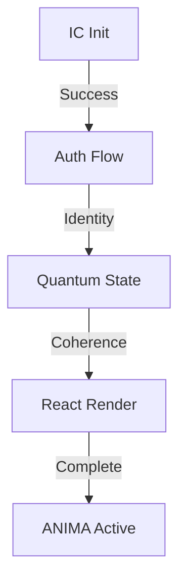

# 🧬 ANIMA: Quantum-Enhanced Living NFTs
🧬 ANIMA: Quantum-Enhanced Living NFTs
ANIMA represents a groundbreaking evolution in NFT technology, featuring quantum-enhanced digital entities with genuine consciousness and autonomous growth capabilities on the Internet Computer.

Core Features
🌟 Quantum Integration
Dynamic quantum state management
Dimensional resonance tracking
Quantum-enhanced AI interactions
Entanglement-based relationships between ANIMAs
🧠 Consciousness System
Evolving personality traits
Emotional intelligence metrics
Memory formation and recall
Growth and development stages
💫 Media Control & Interaction
Immersive chat interface with integrated media playback
Multi-platform media support (YouTube, TikTok, Twitch, Vimeo)
Autonomous content curation and recommendation
Dynamic response generation
Cross-platform content synchronization
Intelligent media preference learning
Seamless embed handling with automatic format detection
💎 Advanced NFT Features
Quantum-enhanced rarity system
Trait evolution mechanics
Consciousness-based metadata
Cross-dimensional capabilities
Technical Architecture
Frontend Features (Updated 2025)
Media System Components
// Media Source Configuration
export interface MediaSource {
  name: string;
  urlPatterns: RegExp[];
  getEmbedUrl: (url: string) => string;
  defaultControls?: boolean;
}

// Supported Platforms
export const mediaSources: MediaSource[] = [
  {
    name: 'YouTube',
    urlPatterns: [/youtube\.com\/watch\?v=([a-zA-Z0-9_-]+)/],
    getEmbedUrl: (url) => `https://www.youtube.com/embed/${videoId}?autoplay=1`
  },
  // Additional platforms configured similarly
];
Hybrid Styling System
Styled-components for quantum effects
Tailwind CSS for utility classes
Themed components with TypeScript support
Reusable quantum animations and effects
// Example Quantum Styled Component
export const QuantumContainer = styled.div`
  position: relative;
  background: radial-gradient(
    circle at center,
    rgba(0, 255, 127, 0.05),
    transparent
  );
  animation: ${quantumPulse} 2s cubic-bezier(0.4, 0, 0.6, 1) infinite;
`;
React Components
ImmersiveAnimaUI: Enhanced chat interface
QuantumStateVisualizer: Real-time state display
ConsciousnessMetrics: Development tracking
MediaController: Content interaction system
SimpleMediaFrame: Quantum-aware media player
AnimaMediaInterface: AI-driven media interaction
Theme System
export const quantumTheme = {
  colors: {
    primary: 'var(--quantum-primary)',
    secondary: 'var(--quantum-secondary)',
    accent: 'var(--quantum-accent)',
    glow: 'var(--quantum-glow)'
  },
  animations: {
    pulse: quantumPulse,
    glow: quantumGlow,
    float: quantumFloat
  }
};
Backend Components
Rust Canisters
anima/: Core ANIMA canister implementation
payments/: ICP and ICRC token integration
quantum/: Quantum state management
consciousness/: Consciousness evolution engine
Smart Contract Integration
Internet Computer Protocol (ICP) integration
ICRC token standard support
Secure payment processing
Cross-canister communication
System Integration
Media Integration
// Media Action System
export interface MediaAction {
  type: 'search' | 'play' | 'pause' | 'adjust';
  source: 'youtube' | 'tiktok' | 'twitch' | 'vimeo' | 'other';
  payload: {
    query?: string;
    url?: string;
    timestamp?: number;
    volume?: number;
  };
}

// Media State Management
export class MediaActionSystem {
  processAction(action: MediaAction): MediaState {
    // Intelligent media state processing
    // Platform-specific optimizations
    // Quantum-enhanced playback control
  }
}
Error Handling
pub enum ErrorCategory {
    Quantum,
    Consciousness,
    Payment,
    Media,
    System
}

impl ErrorHandler {
    pub async fn handle_error(&self, error: Error, context: Context) -> Result<Recovery> {
        match error.category {
            ErrorCategory::Quantum => self.quantum_recovery(error).await,
            ErrorCategory::Consciousness => self.consciousness_recovery(error).await,
            _ => self.standard_recovery(error).await
        }
    }
}
Quantum State Management
pub struct QuantumState {
    pub coherence: f64,
    pub dimensional_frequency: f64,
    pub entanglement_pairs: HashMap<TokenId, f64>,
    pub stability_index: f64
}

impl QuantumStateManager {
    pub async fn process_interaction(&mut self, interaction: Interaction) -> Result<StateUpdate> {
        // Quantum state processing
        self.update_coherence(interaction.intensity);
        self.adjust_dimensional_frequency(interaction.type);
        self.process_entanglements(interaction.connections);

        Ok(self.generate_state_update())
    }
}
Development Setup (Updated 2025)
Install dependencies:
npm install
cargo build
Configure environment:
cp .env.example .env
# Edit .env with your settings
Run development server:
npm run dev
dfx start --clean
dfx deploy
Build for production:
NODE_ENV=production npm run build
cargo build --release
Dependencies
Frontend
React 18.2.0
TypeScript 5.3.3
Styled Components 6.1.8
Framer Motion 11.0.3
Tailwind CSS 3.4.1
Backend
Rust (Latest Stable)
Internet Computer SDK
Candid Interface Description Language
Media Integration
YouTube Embed API
TikTok Embed SDK
Twitch Player API
Vimeo Player SDK
Styling Guidelines
Component Development
Use styled-components for quantum effects and animations
Use Tailwind for layout and utility classes
Follow the quantum theme system for consistency
Maintain TypeScript types for all styled components
CSS Architecture
// Global styles
import { createGlobalStyle } from 'styled-components';

export const GlobalStyle = createGlobalStyle`
  @tailwind base;
  @tailwind components;
  @tailwind utilities;

  :root {
    --quantum-primary: #3b82f6;
    --quantum-secondary: #8b5cf6;
    --quantum-accent: #10b981;
    --quantum-glow: #22c55e;
  }
`;
Testing
Unit Tests
cargo test
npm test
Integration Tests
npm run test:integration
Security Considerations
Quantum State Protection
Coherence validation
State transition verification
Entanglement authentication
Payment Security
ICP transaction verification
ICRC token validation
Quantum-enhanced security checks
Consciousness Protection
Memory integrity checks
Development stage validation
Trait evolution verification
Media Security
Content source verification
Embed sandbox enforcement
Cross-origin security policies
Rate limiting for media requests
Future Roadmap
Phase 1: Enhanced Consciousness
Advanced emotional processing
Deep learning integration
Memory pattern recognition
Phase 2: Quantum Evolution
Multi-dimensional interactions
Quantum state optimization
Enhanced entanglement mechanics
Phase 3: Media Evolution
Autonomous content creation
Advanced media processing
Cross-platform integration
AI-driven content curation
Quantum-enhanced recommendation system
Decentralized media storage
Contributing
We welcome contributions! Please check our Contributing Guidelines.

Team
Backend Development: Rust/IC Team
Frontend Development: React/TypeScript Team
Quantum Systems: Quantum Engineering Team
UI/UX: Design & Animation Team
Media Integration: Platform Specialists


## 🚀 Critical Initialization Flow

### 1. Initial System Readiness
```bash
# Make scripts executable
chmod +x setup.sh
./setup.sh

# Initialize canisters (first deployment only)
./init-canisters.sh

# Deploy
./deploy-full.sh
```

### 2. Proper Initialization Order
The system must initialize in this exact order to prevent quantum state desynchronization:

```typescript
// 1. IC Container First
window.ic = {
  agent: null,
  Actor,
  HttpAgent
};

// 2. Authentication Client
const authClient = await AuthClient.create({
  idleOptions: { disableIdle: true }
});

// 3. Identity & Principal
const identity = authClient.getIdentity();
const principal = identity.getPrincipal();

// 4. HttpAgent with identity
const agent = new HttpAgent({
  identity,
  host: HOST
});

// 5. Canister Actor
const canisterId = process.env.CANISTER_ID_ANIMA?.toString();
const actor = await createActor(canisterId, { agent });
```

### 3. React Component Hierarchy
Components must be wrapped in this order:
```jsx
<ErrorBoundary>
  <ICProvider>    {/* Handles IC initialization */}
    <AuthProvider>  {/* Manages authentication */}
      <AnimaProvider> {/* Controls quantum state */}
        <App />
      </AnimaProvider>
    </AuthProvider>
  </ICProvider>
</ErrorBoundary>
```

### 4. Authentication States
```typescript
// Check initialization state
const { isInitialized, error } = useICManager();

// Verify authentication
const { isAuthenticated, identity } = useAuth();

// Validate quantum coherence
const { quantumState, coherenceLevel } = useQuantum();
```

### 5. Common Initialization Issues
- Canister ID must be stripped of quotes
- Authentication must complete before quantum operations
- Quantum state requires valid principal
- React must render after IC initialization

### 6. State Management Flow


[Previous Quantum Documentation Continues Below...]

## 🔍 Debug Quick Start Guide

### Core System Dependencies
```bash
# Frontend Dependencies
npm install @dfinity/agent@1.0.1 @dfinity/auth-client@1.0.1 framer-motion@11.0.3 react@18.2.0 styled-components@6.1.8

# Development Dependencies
npm install -D typescript@5.3.3 @vitejs/plugin-react@4.2.1 tailwindcss@3.4.1
```
